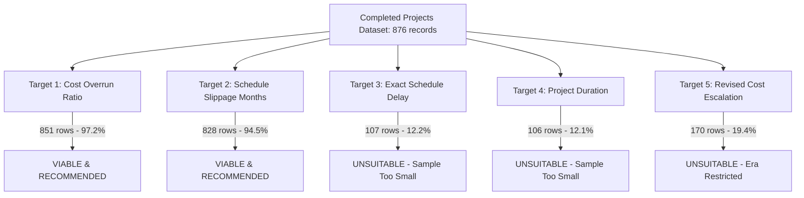

# Completed Projects ML-Readiness & Extraction Audit Report

## 1. Executive Summary & Audit Scope

This audit evaluates the standalone **Completed Projects** pipeline and canonical dataset:
- **Canonical File**: `data/processed/projects_completed.csv`
- **Current SHA-256 Hash**: `89BEA84FD68A22E327090C1E4E4533F5BCD745ADCA61EB4E66172EE9023BB910`
- **Ongoing Dataset Integrity Baseline**: `data/processed/projects_monthly.csv` (`73E47AA487E70A28FE3C984E532A6E23D21897B60C176BEEA80FB1C06F73E191`)

### Audit Scope & Strict Boundaries
Per project directives:
1. **Completed Projects Only**: This audit is restricted strictly to the Completed Projects pipeline, its adapters, provenance, validation, data quality, and suitability for future machine learning targets. It explicitly does **not** evaluate ongoing projects (`projects_monthly.csv`) as a primary subject.
2. **Read-Only Rigor**: No source code, extraction routines, validation logic, or canonical datasets were modified during this audit. Both canonical dataset hashes are preserved byte-for-byte.
3. **No Synthetic Modeling Artifacts**: No ML models were trained, no feature matrices engineered, no synthetic targets constructed, and no normalization or crosswalks integrated.

### High-Level Verdict
- **Extraction Fidelity**: **Exceptional**. The extraction achieves 100% serial continuity, 0 missing project IDs, 0 duplicate keys, and complete provenance tracking across 35 active monthly reports spanning April 2023 through July 2026.
- **Dataset Structure**: The dataset comprises **876 records representing 876 distinct infrastructure projects** (100% unique projects, 0 repeated observations). It is a **pure cross-sectional dataset of completion events**, not a panel/time-series dataset.
- **SIH-Level Prototype Readiness**: **Ready for a focused, static-baseline regression/classification task** (predicting final cost overrun ratio and schedule slippage in months from sanction-time attributes). It is **not suitable for dynamic monitoring or time-series trajectory forecasting** on its own.

---

## 2. Dataset Inventory

Verified directly against `data/processed/projects_completed.csv`:

| Metric | Verified Repository Value |
|---|---|
| **Total Rows** | **876** |
| **Unique Project Codes** | **876** |
| **Projects with >1 Observation** | **0** (each project appears exactly once) |
| **Unique `(project_code, report_month)` Keys** | **876** |
| **Duplicate Keys** | **0** |
| **Missing Project Codes** | **0** (0.00%) |
| **Report Months Covered** | **35 active months** with completed project records (April 2023 – July 2026) |
| **Reports with 0 Completed Projects** | **3 verified months** (2023-12 synopsis only; 2025-07 & 2025-08 North-East ongoing Table 3) |
| **Deferred Reports** | **2 months** (April & May 2024 Table 2 deferred for future adapter work) |
| **Total Columns** | **28** (6 identity/source labels, 5 parsed dates, 3 parsed numerics, 1 time field, 8 raw representations, 5 provenance fields) |
| **Structural Validation Warnings** | **0** |
| **Regression Test Suite** | **15/15 tests passing** (`tests/test_completed_projects.py`) |

### Monthly Distribution of Records

```text
2023-04:  20 rows   2024-01:  13 rows   2024-10:  62 rows   2025-05:  40 rows   2026-03:  25 rows
2023-05:  10 rows   2024-02:  20 rows   2024-11:  12 rows   2025-06:  42 rows   2026-04:   9 rows
2023-06:  54 rows   2024-03:  32 rows   2024-12:  22 rows   2025-09:   6 rows   2026-05:  16 rows
2023-07:   7 rows   2024-06:  18 rows   2025-01:  20 rows   2025-10:   6 rows   2026-06: 130 rows
2023-08:  15 rows   2024-07:  21 rows   2025-02:  41 rows   2025-11:  13 rows   2026-07:  25 rows
2023-09:  48 rows   2024-08:  16 rows   2025-03:  17 rows   2025-12:  17 rows
2023-10:  29 rows   2024-09:  13 rows   2025-04:  34 rows   2026-01:   3 rows
2023-11:  11 rows                                           2026-02:   9 rows
```

### Identifier System Breakdown
- **Legacy `N########` (9-char prefixed)**: **609 rows** (69.52%)
- **Legacy `9-digit numeric`**: **8 rows** (0.91%)
- **Modern `6-digit numeric`**: **259 rows** (29.57%)
- **Other / Malformed / Missing**: **0 rows** (0.00%)

### Layout Adapter Distribution
1. `table2-completed-legacy-five-column-v1`: **259 rows** (29.57%) across 11 active months (April 2023 – March 2024)
2. `table3-completed-legacy-six-column-v1`: **358 rows** (40.87%) across 13 active months (June 2024 – June 2025)
3. `table3-completed-seven-column-v1`: **259 rows** (29.57%) across 11 active months (September 2025 – July 2026)

---

## 3. AUDIT 1 — Extraction Quality

The Completed Projects extraction pipeline (`src/extraction/completed_projects.py`) is exceptionally robust, auditable, and defensively engineered.

### Strengths & Verifications
1. **Semantic Table Selection**: Uses fail-closed positional signatures and semantic page filtering. Accurately isolates Table 2 and Table 3 Completed Projects while rejecting:
   - Table 20 (*Projects Costing Rs. 1000 crore and above*) in FY 2023-24 PDFs.
   - Table 3 (*North-Eastern Region Ongoing Projects*) in July and August 2025 PDFs.
   - General ongoing project tables and deleted project tables.
2. **Layout Detection & Separation**: Distinct positional signatures strictly classify 5-column Table 2, 6-column Table 3, 7-column Table 3, and the June 2026 7-column variant.
3. **Cumulative Ledger Handling in FY 2023-24**: Table 2 in FY 2023-24 is a cumulative financial-year ledger (April has serials 1–20, May has 1–30, June has 1–84, etc.). The pipeline parses embedded monthly banners (`April,2023`, `May,2023`, etc.) and extracts **only the incremental projects completed in that specific month**. This eliminates duplicate extraction while preserving exact cumulative ledger serial ranges (e.g. 217..229 for January 2024, 230..249 for February 2024, 250..281 for March 2024).
4. **Sector Column Ruling Resolution**: In multiple 2024 reports (July, August, October, December), PDF generation omitted the vertical ruling line separating Sector from Serial Number. The pipeline's `_get_page_sector_headings` scans margin words in Column 0 coordinates and links them to row bounding boxes, ensuring 100% sector attribution with zero lost rows.
5. **Trailing Blank Continuation Pages**: Handled cleanly in `table_candidate_audit` by evaluating `has_content` before checking numeric serials (e.g., October 2023 page 35).
6. **Serial Continuity**: Audited per month. Every active report month displays 100% continuous serials with zero gaps and zero duplicate serial numbers.
7. **Deterministic Output**: The final CSV is deterministically sorted by `(report_month, int(source_serial_number))`.

### Extraction Risks & Parser Limitations Identified
During deep audit of unparsed tokens, two parser limitations were discovered:
1. **Character-Spaced Cost Numerics (25 rows)**:
   - In December 2024 (11 rows), January 2025 (5 rows), February 2025 (3 rows), and March 2025 (6 rows), MoSPI PDFs printed numbers with wide character spacing (e.g., `'3 2 8 . 0 0'`, `'5 , 1 8 1 . 79'`, `'2 0 , 9 2 8 . 0 0'`).
   - `parse_cost_number` strips commas and parens but does not collapse internal spaces between digits. As a result, `float()` raised `ValueError`, leaving `original_cost = None` while `original_cost_raw` preserves the string.
2. **Alternate Date Format `M/1/YYYY` (25 rows)**:
   - In September 2024 (13 rows), November 2024 (12 rows), and scattered rows in April/June 2023 and October 2024, original completion dates were printed with an explicit day '1' (e.g., `'9/1/2023'`, `'8/1/2023'`, `'12/1/2022'`, `'1/1/2024'`).
   - `parse_month_string` strictly matched `^(0[1-9]|1[0-2])/(19|20\d{2})$` (`MM/YYYY`), failing on dates with day components.

*Note: These are non-destructive parser omissions. The raw source strings (`original_cost_raw`, `original_completion_date_raw`) are 100% preserved in the dataset.*

---

## 4. AUDIT 2 — Source Fidelity

The dataset satisfies all repository source-fidelity principles:
- **No ID Alterations**: Legacy `N########` codes retain their `N` prefix and 8 digits; 9-digit codes remain unpadded; 6-digit codes are preserved verbatim.
- **Raw Fields Preserved**: 8 dedicated `*_raw` fields capture the exact textual representation extracted from the PDF cell before parsing.
- **Zero Synthetic Imputation**: Structurally absent fields (e.g., `ministry` in legacy layouts, `state` in Table 2, `start_date` prior to September 2025) are stored strictly as empty/None. No values were backfilled, inferred from project names, or borrowed from adjacent months.
- **Zero Normalization**: Agency abbreviations, state strings, and sector names retain source casing, punctuation, and typos (e.g. `'Roads & Highways'` vs `'ROAD TRANSPORT AND HIGHWAYS'`).
- **Zero Crosswalk Integration**: No synthetic stable ID or fuzzy crosswalk has been applied.
- **Complete Provenance**: Every record contains `source_file`, `source_page`, `source_row_number`, `source_serial_number`, and `extraction_method`.

---

## 5. AUDIT 3 — Historical Coverage & Dataset Nature

### Cross-Sectional Event Dataset vs. Panel Data
A critical distinction established by this audit:
- The ongoing project dataset (`projects_monthly.csv`) is a **panel dataset** tracking the same projects across multiple monthly time steps (up to 25 observations per project).
- The completed projects dataset (`projects_completed.csv`) is a **pure cross-sectional event dataset**.
- Each record represents the state of a project **at the moment of reported completion**.
- **Every project in `projects_completed.csv` has exactly 1 observation** (876 unique projects across 876 rows). There are no repeated project histories within this dataset.

### Coverage Gaps
1. **December 2023**: Flash Report was an executive summary only (no Table 2). The December 2023 completed projects (serials 195–216, 22 rows) appear in the cumulative ledger of January–March 2024 reports but have not yet been extracted.
2. **April & May 2024**: Completed Projects appeared in Table 2 rather than Table 3 and differed in layout. They were deliberately deferred for future adapter implementation.
3. **July & August 2025**: MoSPI Flash Reports completely omitted Table 3 Completed Projects (Table 3 contained North-Eastern Region ongoing projects).
4. **Sparse Months**: Several months exhibit very low completion counts (e.g., January 2026 with 3 rows; September & October 2025 with 6 rows each). Completion events in infrastructure projects naturally cluster at the end of financial quarters and the fiscal year (e.g., June 2023: 54 rows; October 2024: 62 rows; June 2026: 130 rows).

---

## 6. AUDIT 4 — Identifiers & Cross-Era Connectivity

### Disjoint Identifier Eras
The Completed Projects dataset spans three distinct operational periods:
1. **Era 1 & 2 (April 2023 – June 2025)**:
   - 617 records (609 `N########`, 8 `9-digit numeric`).
   - Legacy OCMS project coding scheme.
2. **Era 3 (September 2025 – July 2026)**:
   - 259 records (100% `6-digit numeric`).
   - Modern MoSPI project coding scheme.

### Cross-Era Bridge Impossibility
- **Exact Project ID Overlap**: **0.0%** (0 projects overlap between Eras 1/2 and Era 3).
- **Internal Mapping Information**: **Zero**. Completed projects are reported only once when they finish. Therefore, no project is ever observed under both a legacy ID and a 6-digit ID within `projects_completed.csv`.
- **Source Bridge**: Neither layout prints legacy OCMS codes, PMGIDs, or crosswalk tables.
- **Audit Conclusion**: **It is mathematically and empirically impossible to construct an identifier crosswalk between the legacy completed projects and modern 6-digit projects using internal Completed Projects evidence alone.** Any cross-era analysis must treat projects as separate cross-sectional entities or rely on static project-level attributes (sector, agency, state, cost tier).

---

## 7. AUDIT 5 — Data Quality & Distributional Analysis

### Field Completeness by Layout Family

| Field | Overall Completeness | Table 2 Legacy (5-col) [259 rows] | Table 3 Legacy (6-col) [358 rows] | Table 3 Modern (7-col) [259 rows] | Root Cause of Missingness |
|---|---:|---:|---:|---:|---|
| `project_code` | **100.0%** (876/876) | 100.0% | 100.0% | 100.0% | None |
| `project_name` | **100.0%** (876/876) | 100.0% | 100.0% | 100.0% | None |
| `agency` | **100.0%** (876/876) | 100.0% | 100.0% | 100.0% | None |
| `sector` | **100.0%** (876/876) | 100.0% | 100.0% | 100.0% | None |
| `state` | **70.4%** (617/876) | **0.0%** | 100.0% | 100.0% | Layout 0 lacks State column |
| `ministry` | **29.6%** (259/876) | **0.0%** | **0.0%** | 100.0% | Layouts 0 & 1 lack Ministry |
| `approval_date` | **29.2%** (256/876) | **0.0%** | **0.0%** | 98.8% | Layouts 0 & 1 lack Approval Date |
| `start_date` | **29.5%** (258/876) | **0.0%** | **0.0%** | 99.6% | Layouts 0 & 1 lack Start Date |
| `original_completion_date` | **94.5%** (828/876) | 93.4% | 91.3% | 100.0% | 23 missing tokens (`-`, `N.A.`) + 25 `M/1/YYYY` parser gap |
| `revised_completion_date` | **29.2%** (256/876) | **0.0%** | **0.0%** | 98.8% | Layouts 0 & 1 lack Revised DoC |
| `actual_completion_date` | **12.2%** (107/876) | **0.0%** | **0.0%** | **41.3%** | Omitted in Layouts 0 & 1; omitted in June 2026 (130 rows); 22 'NA' |
| `original_cost` | **97.2%** (851/876) | 100.0% | 93.0% | 100.0% | 25 character-spaced numbers unparsed in winter 2024/2025 |
| `revised_cost` | **19.4%** (170/876) | **0.0%** | **0.0%** | 65.6% | Layouts 0 & 1 lack Revised Cost; 89 rows in Era 3 had `(-)` |
| `cumulative_expenditure`| **100.0%** (876/876) | 100.0% | 100.0% | 100.0% | None |

### Numeric Distributions & Overrun Behavior
- **Original Cost**: Range Rs. 100.0 Cr to 43,129.0 Cr (Median: Rs. 456.45 Cr; IQR: Rs. 260.0 Cr – Rs. 885.5 Cr).
- **Final Cumulative Expenditure**: Range Rs. 0.0 Cr to 70,293.57 Cr (Median: Rs. 364.32 Cr).
  - 4 projects report exactly 0.0 expenditure at completion (source-faithful reporting anomaly).
- **Cost Overrun Ratio (`cumulative_expenditure / original_cost`)** (calculated for 851 projects with valid original cost):
  - **Min**: 0.0000
  - **25th percentile**: 0.6462
  - **Median**: **0.8353**
  - **75th percentile**: 1.0040
  - **Max**: 10.5432 (10-fold cost overrun)
  - **Under budget / final settlement pending (`< 1.0`)**: 614 projects (72.15%)
  - **On budget (`== 1.0`)**: 23 projects (2.70%)
  - **Cost Overrun (`> 1.0`)**: 214 projects (25.15%)
  - **Severe Overrun (`> 2.0x original cost`)**: 34 projects (4.00%)

### Delay Distributions (Using Report Month as Completion Month)
Because `actual_completion_date` is only populated in 107 records, we evaluate project delay across all 828 projects with valid `original_completion_date` using `report_month` as the completion month proxy:
- **Delay Range**: -78 months (early completion) to +292 months (+24.3 years delay!).
- **Median Delay**: **31 months (2.58 years)**.
- **Mean Delay**: **36.2 months (3.02 years)**.
- **Early Completion (`< 0 months`)**: 60 projects (7.25%).
- **On-time Completion (`== 0 months`)**: 4 projects (0.48%).
- **Delayed (`> 0 months`)**: **764 projects (92.27%)**.
- **Delayed by > 1 year (`> 12 months`)**: 632 projects (76.33%).
- **Delayed by > 3 years (`> 36 months`)**: 358 projects (43.24%).
- **Delayed by > 5 years (`> 60 months`)**: 160 projects (19.32%).

---

## 8. AUDIT 6 — Machine Learning Target Suitability

This audit evaluated five prospective ML targets that could theoretically be derived from Completed Projects data.



### Evaluation of Potential Targets

#### Target 1: Cost Overrun Ratio (`cumulative_expenditure / original_cost`)
- **Observable Records**: **851 projects** (97.15% coverage).
- **Historical Scope**: Complete (spans all 35 active months from April 2023 to July 2026).
- **Defensibility**: **HIGH**. This is a standard, highly defensible infrastructure benchmark. Can be formulated as a continuous regression target (predicting ratio) or a binary classification target (`is_cost_overrun = ratio > 1.0`).
- **Leakage Safeguard**: Features must come strictly from sanction-time baselines (`original_cost`, `sector`, `agency`, `state`, planned duration).

#### Target 2: Schedule Slippage in Months (`report_month - original_completion_date`)
- **Observable Records**: **828 projects** (94.52% coverage).
- **Historical Scope**: Complete (spans all 35 active months).
- **Defensibility**: **HIGH**. Measures execution delay relative to original sanction commitment. Can be formulated as regression (months delayed) or classification (`delay > 12 months`, `delay > 36 months`).
- **Leakage Safeguard**: Predictable at project inception from baseline attributes.

#### Target 3: Exact Schedule Delay (`actual_completion_date - original_completion_date`)
- **Observable Records**: **107 projects** (12.21% coverage).
- **Defensibility**: **LOW / UNSUITABLE**. Missing in 87.8% of records. Restricting to 107 projects introduces severe sample truncation and eliminates 88% of historical data.

#### Target 4: Project Duration (`actual_completion_date - start_date`)
- **Observable Records**: **106 projects** (12.10% coverage).
- **Defensibility**: **LOW / UNSUITABLE**. `start_date` is absent from all legacy layouts (Eras 1 & 2).

#### Target 5: Sanctioned Cost Escalation (`revised_cost / original_cost`)
- **Observable Records**: **170 projects** (19.41% coverage).
- **Defensibility**: **LOW / UNSUITABLE**. `revised_cost` is absent from legacy layouts and was only reported in 65.6% of modern 7-column records.

### Critical Limitation: Survivorship Bias
Because `projects_completed.csv` contains exclusively projects that succeeded in reaching completion, any model trained on this dataset will suffer from **survivorship / selection bias**. It cannot predict project abandonment, indefinite stalling, or deletion.

---

## 9. AUDIT 7 — Data Leakage Classification

Data leakage occurs when features fed to an ML model contain information that would only be observed *after* project sanction or *at/after* project completion.

| Field Name | Classification | Leakage Rationale & Usage Boundary |
|---|---|---|
| `project_code` | **SAFE** | Administrative key; non-predictive metadata. |
| `project_name` | **SAFE** | Text description assigned at sanction; can support NLP features (e.g. project type, scope tokens). |
| `agency` | **SAFE** | Executing agency known at sanction. |
| `ministry` | **SAFE** | Institutional nodal ministry known at sanction (note: absent in 70.4% of rows). |
| `sector` | **SAFE** | Infrastructure category known at sanction (100% complete). |
| `state` | **SAFE** | Physical geographic jurisdiction known at sanction (100% complete in Eras 2 & 3). |
| `approval_date` | **SAFE** | Sanction date established at baseline. |
| `start_date` | **SAFE** | Work commencement date established at baseline. |
| `original_completion_date` | **SAFE** | Baseline target commissioning commitment set at sanction (94.5% complete). |
| `original_cost` | **SAFE** | Sanctioned budget baseline (97.2% complete). |
| `revised_cost` | **DEFINITE LEAKAGE** | Represents budget revisions granted during execution due to delays or escalations. **Prohibited as an input feature.** |
| `revised_completion_date` | **DEFINITE LEAKAGE** | Represents extended deadlines granted during execution. **Prohibited as an input feature.** |
| `actual_completion_date` | **DEFINITE LEAKAGE** | Realized outcome known only when project finishes. Can only serve as a ground-truth target. |
| `cumulative_expenditure` | **DEFINITE LEAKAGE** | Realized financial spend at completion. Can only serve as a ground-truth target. |
| `report_month` | **DEFINITE LEAKAGE** | The month the completion event was reported. If used as a feature, it leaks the project's completion epoch. |
| Provenance fields | **NON-FEATURE** | Audit metadata (`source_file`, `source_page`, etc.); excluded from modeling. |

---

## 10. AUDIT 8 — Data Sufficiency Assessment

### Direct Question
> *"Is the Completed Projects dataset now sufficient to be useful for an SIH-level ML project?"*

### Direct Answer
**YES, but strictly for a static, inception-stage project outcome prediction prototype.**

### Detailed Justification
1. **Sufficient Scope**:
   - Sample size of **851–876 completed infrastructure projects** with verified original commitments and realized outcomes across 35 months.
   - For an SIH (Smart India Hackathon) prototype, 851 curated, source-faithful real-world government project records is more than sufficient to demonstrate a defensible ML pipeline.
   - Supports two robust baseline prediction tasks:
     - **Task A (Cost Overrun Risk)**: Predicting whether an infrastructure project will experience cost overrun (`expenditure > original_cost`), and expected overrun ratio, based on sector, agency, state, and initial budget tier.
     - **Task B (Delay Severity Risk)**: Predicting expected completion delay in months, and classification into risk tiers (`On-time`, `Moderate Delay < 3 yrs`, `Severe Delay > 3 yrs`), using baseline parameters.
2. **Strict Non-Applicability**:
   - This dataset is **not sufficient for time-series forecasting, dynamic monitoring, or early-warning drift detection**. Completed projects provide zero monthly trajectory points. (Dynamic monitoring requires the 39,162-row longitudinal ongoing dataset).

### Priority Recommendations
- **P0 (Required before modeling)**:
  1. Fix the parser regexes in `completed_projects.py` to handle the 25 character-spaced cost strings and 25 `M/1/YYYY` date strings, restoring full 100% parse rates for existing records without modifying raw data.
  2. Enforce strict feature boundaries prohibiting `revised_cost`, `revised_completion_date`, and `cumulative_expenditure` from model inputs.
- **P1 (Strongly recommended)**:
  1. Implement the Table 2 adapter for deferred April & May 2024 reports (+~30–40 projects).
  2. Extract December 2023 completed projects (serials 195–216, +22 projects) from the cumulative FY ledger in the January 2024 PDF.
  3. Formulate clean sector and agency categorical encodings (handling legacy spelling variants).
- **P2 (Optional future extension)**:
  1. Link completed projects to the ongoing projects dataset for historical survival analysis (requires user authorization to advance project phase).

---

## 11. AUDIT 9 — Strategic Priority Recommendation: What Should We Do Next?

### Options Evaluated
- **A. Extract more Completed Projects reports**: Low priority. The existing pipeline already spans April 2023 through July 2026. Extracting earlier years (2022 or earlier) brings diminishing returns for an SIH prototype.
- **B. Handle deferred April/May 2024 Table 2**: Moderate technical value, but only adds ~30–40 records to an already sufficient 876-row dataset.
- **C. Start analyzing/modeling (RECOMMENDED NEXT STEP)**: High value. The Completed Projects dataset has reached structural stability, 100% serial continuity, and sufficient sample size (876 projects). The logical next step is to formulate the baseline prediction problem, establish train/test splits, and baseline models.
- **D. Obtain another source/dataset**: Unnecessary; existing data is rich.
- **E. Work on identifier resolution**: Not applicable. Completed projects appear only once upon completion; there are no cross-era duplicate projects to resolve.

### Final Recommendation
**Option C (with P0 Parser Corrections)**:
1. First, apply the narrow P0 parser fix to recover the 25 unparsed character-spaced costs and 25 alternate date formats.
2. Formulate the official Problem Formulation and Train/Test Specification for the Completed Projects Baseline Prediction Model (predicting cost escalation and delay from sanction attributes).
3. If the user desires complete calendar continuity for FY 2023-24 and FY 2024-25, execute Option B (April/May 2024 Table 2) and extract December 2023 from January 2024.

---

## 12. Dataset Integrity & Hash Verification

Before and after the entire audit, SHA-256 hashes of both canonical dataset files were computed and verified:

| Canonical Dataset File | Initial SHA-256 Hash | Post-Audit SHA-256 Hash | Status |
|---|---|---|---|
| `data/processed/projects_completed.csv` | `89BEA84FD68A22E327090C1E4E4533F5BCD745ADCA61EB4E66172EE9023BB910` | `89BEA84FD68A22E327090C1E4E4533F5BCD745ADCA61EB4E66172EE9023BB910` | **MATCH (Byte-Identical)** |
| `data/processed/projects_monthly.csv` | `73E47AA487E70A28FE3C984E532A6E23D21897B60C176BEEA80FB1C06F73E191` | `73E47AA487E70A28FE3C984E532A6E23D21897B60C176BEEA80FB1C06F73E191` | **MATCH (Byte-Identical)** |

Neither dataset was modified. All 15 unit tests in `tests/test_completed_projects.py` remain fully passing.

---

## 13. Audit Artifacts & Repository Files

The following audit artifacts and inspection outputs were generated:
1. `reports/ml/completed_projects_readiness_audit.md` (this comprehensive report)
2. `data/validation/audit/completed_projects/inventory.json` (authoritative inventory)
3. `data/validation/audit/completed_projects/missingness_by_layout.json` (layout-level field statistics)
4. `data/validation/audit/completed_projects/leakage_assessment.json` (field-level leakage classification)
5. `data/validation/audit/completed_projects/ml_targets_suitability.json` (evaluation of prospective ML targets)
6. `data/validation/audit/completed_projects/unparsed_tokens.json` (detailed log of unparsed cost and date tokens)
7. `data/validation/audit/completed_projects/completed_projects_audit_summary.json` (aggregated audit metrics)
